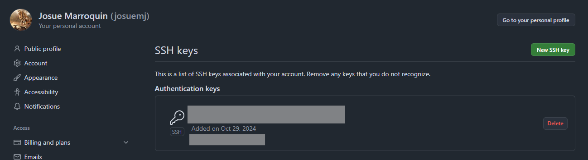

# React + TypeScript + Vite
## Cytoscape demo

- ## 1 Create a public repository with a readme file in markdown (current repo).
- ## 2 Connect to Github using SSH.

- # 3 Create a pull request and request a review
    Create a github action that triggers when a pull request is opened targeting the main branch. The github action must print in the console two messages. One with an environment variable, and a second one with an environment secret.